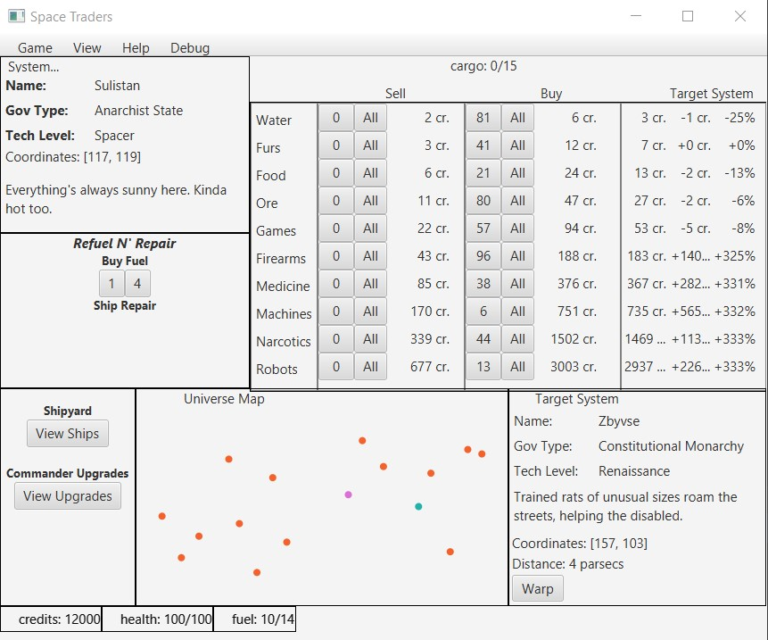

# Star Traders

In Spring 2020, I worked in a team to develop a JavaFX application, Star Traders, for my CS 2340 course, Objects and Design, at Georgia Tech modeled on the 2002 Palm OS game, Space Traders. I enjoyed the project immensely, going beyond the requirements of course milestones to adapt additional features to the project. I was personally proud to have implemented [MIDI support](../resources/MidiMusicPlayer.java) for the game to match a classic aesthetic playing on the original game. 

I also enjoyed working on my universe-generation design for the application, which supported easy expansion for lore elements such as custom names and bios.

While working on the project, I gained experience in making JavaFX and taught myself to use the application software's markdown language, FXML. Following the completion of the project, I applied for and recieved a position as a TA for the course. As a TA, one of my first goals was to ease the barrier of entry for writing JavaFX applications by providing a [FXML tutorial](../resources/Intro_to_FXML_in_JavaFX.pdf) to my students, such that I could provide some of my self-taught learnings to help propel students in starting their own JavaFX projects.

